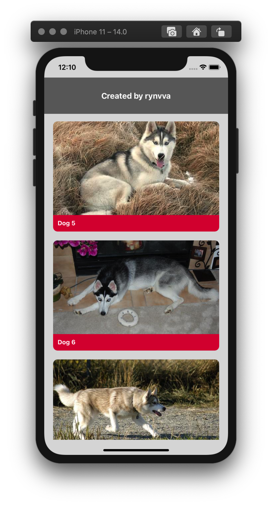
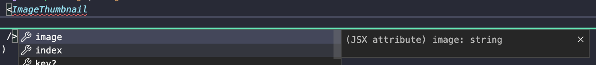
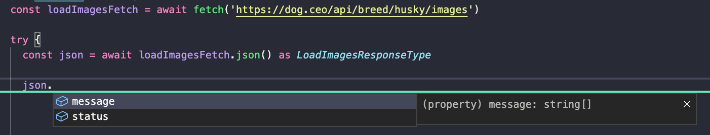

<p align="center">
  
  
  
  
</p>

# Dogs App

> Projek Contoh Untuk Komponen dan Fetch di React-Native Menggunakan TypeScript

<p align="center">
  
</p>

# Catatan

Projek ini di init menggunakan perintah ```npx react-native init dogs_app --template react-native-template-typescript``` menggunakan **Node.js 15.5.0**

# Running Project

- ```git clone https://github.com/crocodication/dogs_app.git```
- ```cd dogs_app```
- ```npm install```

Jika menggunakan MacOS, lakukan juga

- ```cd ios; pod install; cd ..```

Kemudian

- ```npx react-native run-android``` / ```npx react-native run-ios```

# Tujuan 

Semoga dengan sample project ini bisa mengambil poin - poin sebagai berikut

- Pemetaan Type untuk props komponen, berguna untuk memunculkan suggest auto-complete props pada komponen custom



- Pemetaan Type untuk respon API, berguna untuk memunculkan suggest auto-complete saat mendapatkan data dari API

